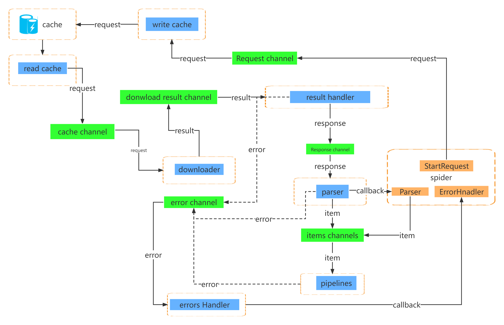

# 架构设计
# 设计思想
本项目在模块功能和数据处理流程方面借鉴了scrapy的设计思想，实现下载、调度、解析及数据处理各模块间解耦。
* 模块间的数据交互基于channel实现。
* 在系统调度方面，不同请求间采用异步处理，单个请求的流程采用同步方式。
* 提供统一的pipelines和middlerwares接口作为业务功能扩展的入口
* 充分利用golang的多核处理能力
* 以引擎和调度器为核心，实现数据扇入扇出

# 数据请求处理流程图

