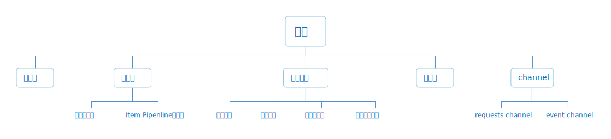
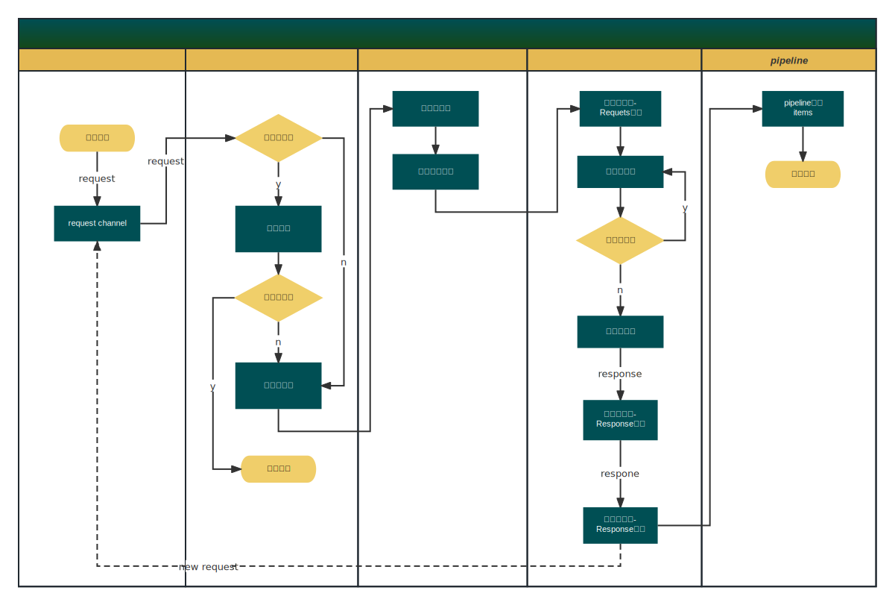

## 引擎架构图  



#### 说明

Tegnaria的引擎由三个模块构成：

- 调度器负责请求的调度过程，为每一个请求单独启用一个协程进行处理，请求的后续生命周期都在该协程中流转  

- 中间件，包含两部分，即下载中间件，用于在请求进入下载器之前对requests对象进行修饰；pipeline则负责处理解析出来的item

- 工作组件主要负责对请求进行下载、对响应进行解析处理，同时也会对处理过程中发生的事件进行处理  

- 下载器主要是负责对请求进行下载并对响应进行封装处理

## 数据流



#### 说明

- 爬虫启动之后引擎会主动调用爬虫的```StartRequest```函数，发起种子请求，作为爬虫起始点  

- 爬虫的```StartRequest```和引擎通过一条channel管道和引擎交互request对象  

- 引擎在接收到请求对象之后首先会进入去重组件执行去重逻辑，如果去重成功则直接丢弃，否则进入请求队列  

- 调度器从队列中读取请求对象，并启动一个工作单元协程执行该请求对象的抓取流程  

- 在工作单元中请求对象首先按照给定的优先级进入下载中间件的```ProcessRequest```对请求进行修饰,例如挂载代理及添加请求头等操作  

- request对像修饰完成后进入限速器，若当前请求量已经达到上限则等待直至满足速率要求    

- 经过限速之后进入下载器，执行下载流程  

- response 对象进入 spider 的`Parser`函数进行解析，注意，这里的`Parser`是一个泛化概念其指向的是构造 requests 对象时绑定的与 spider 实例关联的解析函数

- 解析过程如果生成新的请求对象则通过引擎的 channel 提交到引擎，进行处理；若生成 item 则将其发送到 item 关联的 channel

- pipeline 组件通过 item channel 接收到 item 后就可以对其进行处理

- 单个请求处理流程结束

- 若在上述的工作单元执行过程中捕获到错误或异常，引擎会主动调用爬虫对象的`ErrorHandle`函数对这些错误进行处理，注意，具体的处理逻辑由用户实现

